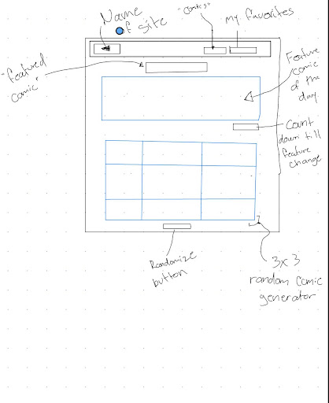
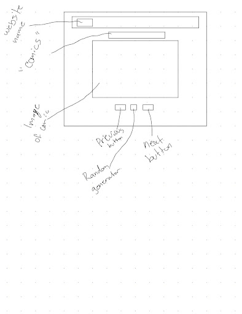
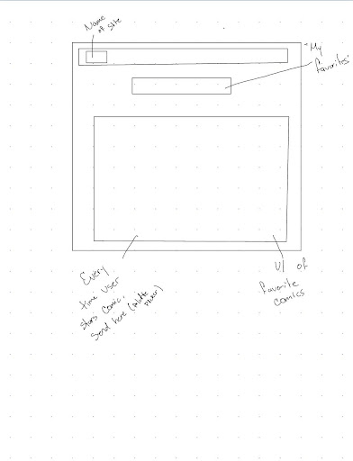
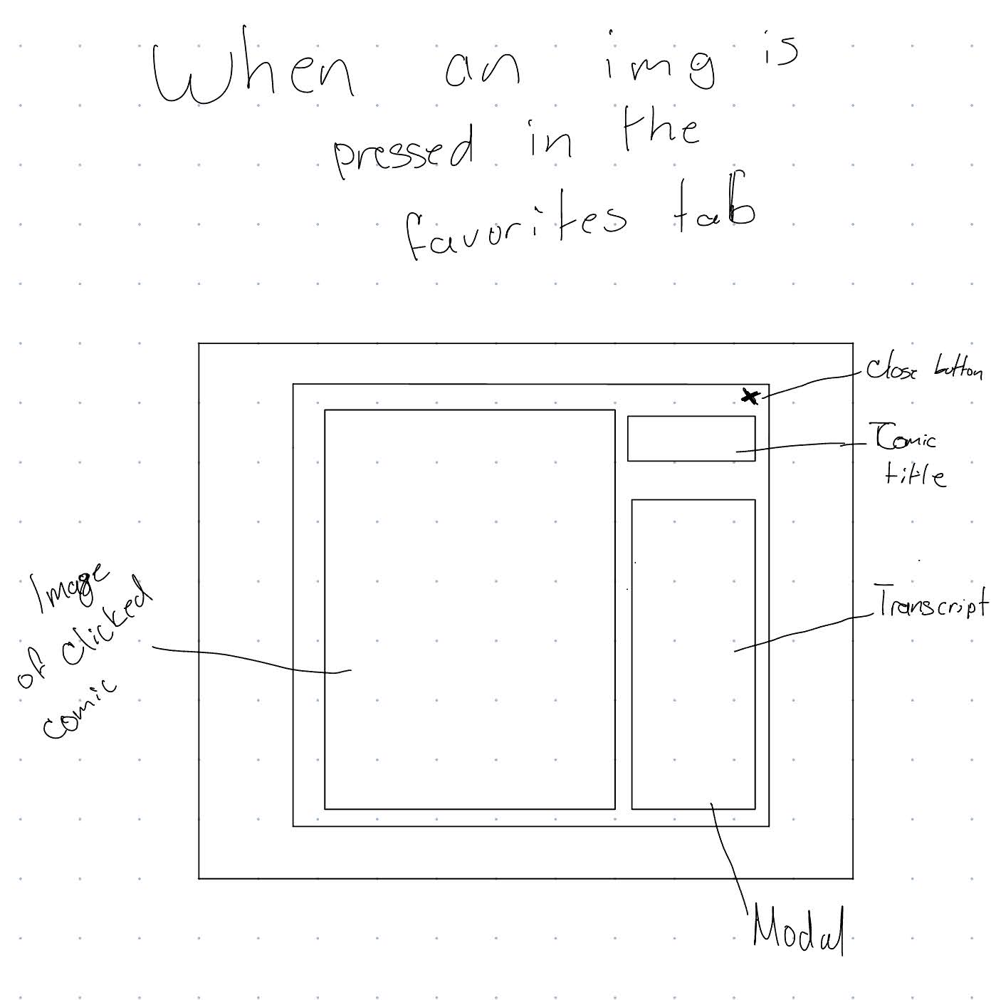

# 🖌️ The Daily Doodle

## 📌 Introduction
Welcome to **The Daily Doodle** — your go-to spot for all things doodles and comics, delivering daily creative entertainment right to your screen.  
This project was built to inspire creativity, spread smiles, and give people a quick, fun break from their day. Whether you’re a doodle enthusiast, a casual comic reader, or just someone looking for lighthearted daily content, The Daily Doodle is made for you.

---

## 🚀 Deployment
- **Live Site:** [The Daily Doodle](https://kurasmagnolia.github.io/the-daily-doodle/)  
- **Screenshots:**
  Coming soon!

---

## 🔗 Additional Links
- **🖼 Wireframe:**  
  
  
  
  

---

## 🛠 Tech Stack
**Languages & Frameworks:**
- HTML  
- CSS  
- JavaScript  

**Libraries / APIs:**
- XKCD API  
- Friconix  
- Google Fonts  

**Tools:**
- Canva  
- GitHub  
- GitHub Pages  
- Visual Studio Code  
- Vite  
- Node.js  

---

## ⚙️ Setup Instructions

**1️⃣ Clone the repository**
```bash
git clone https://github.com/your-username/the-daily-doodle.git
